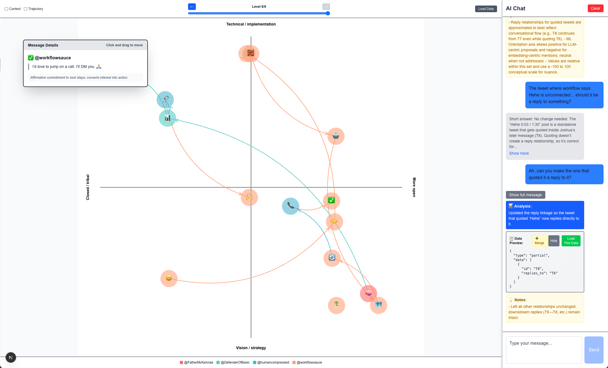

# Discourse Maps

A simple AI-powered interface for data modeling with chat integration.



## Features

- **Main Data Display**: Shows the current state of your model data in a formatted JSON view
- **AI Chat Sidebar**: Interactive chat with OpenRouter integration
- **Tool Calling**: AI can write data to the model using a specialized tool
- **Local Storage**: Model data persists across page refreshes
- **Reset Functionality**: Clear chat context while preserving model data

## Setup

1. Install dependencies:
   ```bash
   npm install
   ```

2. Create a `.env.local` file in the root directory:
   ```
   OPENROUTER_API_KEY=your_openrouter_api_key_here
   ```

3. Get your OpenRouter API key from [OpenRouter](https://openrouter.ai/)

4. Run the development server:
   ```bash
   npm run dev
   ```

5. Open [http://localhost:3000](http://localhost:3000) in your browser


## Manual flow

[Example usage](https://x.com/workflowsauce/status/1972806764421947565)

## Instructions

1. Find some text that you want to visualize. Twitter threads, text messages, and even transcripts can work for this.

2. Copy the text and paste it into ChatGPT or Claude, with the following prompt:

```
I want to do an exercise with you. It should be fairly simple. I will give you a set of messages. I would like you to do the following.

1. Read the messages.

2. Identify the nature of the discussion, both (a) what is being stated and argued about as well as (b) what is being unconsciously protected or defended or argued for. The nature of the arguments, how they evolve, how they circle each other, all of these are relevant.

3. Assign each message an ID, and note the relationship of each one to each other (tree-like replies). Some tweets will appear multiple times, as they are offered in order of reply and may appear in multiple "branches."

4. Write a short assessment of each tweet, that captures what you see. Include an emoji that reflects the essence of the tweet (it's tone, content, and rhetorical purpose).

5. Determine two (or more!) axes that are most relevant to the movement of the conversation. One in particular that I like for Y is "openness," where positive values indicate more openness, lower values indicate lower openness, and negative values indicate rising tribalism and hostility. Other axes might be the nature of the discussion or the structure of the arguments being presented (e.g., technical vs cultural, emotional vs rational, personal vs philosophical). This will vary, but one particular range may stick out more than others.

5. Evaluate all of the messages to determine relative values for each axis. Make the values as specific and detailed as possible (-100 to 100 or more).

6. Output a JSON object to include all of the data, as follows:

{
  "axes": {
    [{
      "label": "Openness",
      "positive": "More open",
      "negative": "Closed / tribal"
    },
    {
      "label": "Ontology",
      "positive": "Fluid / subjective",
      "negative": "Deterministic / hierarchical"
    },
    { ... }
    ]
  },
  "data": [
    {
      "id": "T1",
      "author": "<screen name>",
      "emoji": "📖",
      "text": "<full text of the tweet>",
      "estimation": "Neutral definitional framing of NPC theory.",
      "coords": [-3, 92, ...],
      "replies_to": "T2"
    }
]
}

Sound good?
```

(I usually paste this in first, followed by the tweets. That seems to work well. With newer models, this might not make a big difference.)

3. Take the resulting JSON, copy it, and paste it into [the Claude artifact here](https://claude.ai/public/artifacts/009d852f-8177-4d2e-a195-de1c997e8cb5).

4. Explore and enjoy!

**Notes:** You may want to ask the LLM to fix certain things. Threading is hard. It may get this wrong. You can also ask for more axes. You can specify ones you want it to use, or ask it to use its judgement. This can be quite fun.
